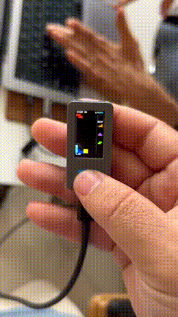
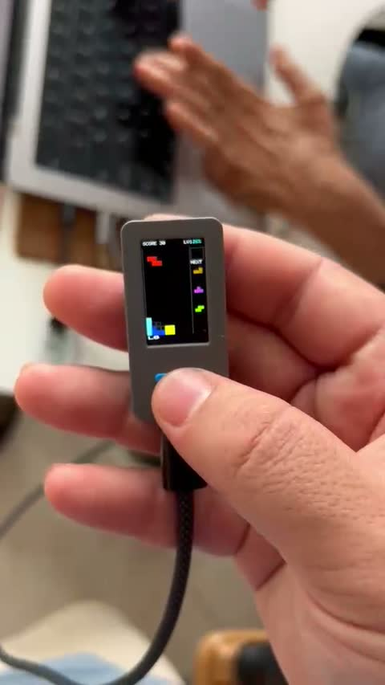
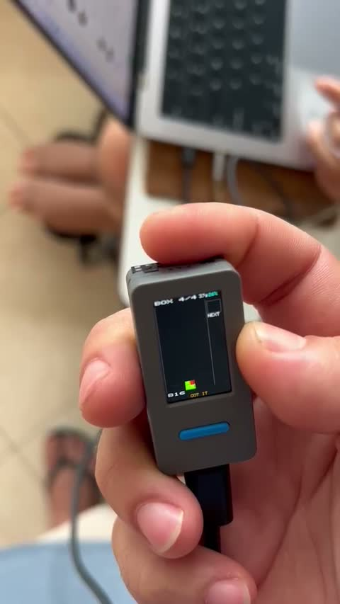

# Stackfall

A tilt-controlled falling-block game for the **M5StickS3** — you steer, rotate, and drop the pieces
by tilting the stick in your hand, using its BMI270 accelerometer. No joystick, (almost) no buttons.

<p align="center">
  <br>
  <em>Stackfall on real hardware — tilt to move, dip to rotate and drop.</em>
</p>

## What it is

Stackfall is an original falling-block game written from scratch for a single 135×240 M5StickS3.
The engine is pure host-tested C++17; only a thin hardware layer touches the M5 libraries. The
whole thing is offline — no Wi-Fi, no BLE, no network — and the build gate fails if any of those
symbols link.

|  |  |
|--|--|
|  |  |
| Gameplay | The calibration maze (learn your tilt axes) |

## Autopilot

A PC can play the stick by itself over USB. A classic heuristic and a small language
model compete, and the heuristic clears 40 lines on the real device without a single
misplaced piece. The story and the numbers:
[Stackfall plays itself](docs/articles/2026-09-26-stackfall-plays-itself.md).

## Controls

You hold the stick upright in one hand, screen toward your face, IR end up, USB-C down.

| Action | Gesture |
|---|---|
| Move left / right | **Tilt** the stick left / right (the angle picks the column) |
| Rotate | **Dip the top away** from your face (IR end forward), or the **blue** button |
| Soft drop | **Dip the top toward** your face, while held |
| Hard drop | **Side** button |
| Hold / swap | **Blue** button (hold-to-swap) |
| Pause | **Blue + side** chord |
| Re-run calibration | **Blue ×4** |

Tilt controls default on (`imuControls`); a buttons-only mode is available.

### Calibration tutorial

On first launch a short tutorial learns *your* grip: hold still, then four "ball into the box"
pages (tilt right / left, dip away / toward), then a practice **maze** you steer through. Your
comfortable tilt and dip ranges become the control scale, so the game fits whatever pose is
comfortable for you.

## Build & flash

Requires [PlatformIO](https://platformio.org/).

```bash
# flash to a connected M5StickS3
pio run -e m5stack-sticks3 -t upload

# serial monitor (telemetry protocol in docs/SERIAL.md)
pio device monitor -b 115200
```

Or install the prebuilt firmware from **M5Burner** (search "Stackfall").

## Host tests

The game logic is host-testable without hardware:

```bash
cmake -S . -B build && cmake --build build && ./build/sf_tests   # run from the repo root
bash tools/gates.sh                                              # build gates
```

## Known issue

- **Soft drop needs a large toward tilt.** From a relaxed, toward-pitched grip the soft-drop gesture
  can require an uncomfortable amount of forward tilt. A fix (return-stroke / headroom-aware toward
  detection) is in progress. Everything else — steering, rotation, hard drop, the calibration
  tutorial — plays well.

## Layout

```
src/stackfall/   pure C++17 game engine, input, UI (no Arduino/M5 headers)
src/hal/sticks3/ M5StickS3 hardware layer (display, IMU, buttons, power)
src/main.cpp     firmware entry point
include/         generated headers
test/host/       host unit tests + golden fixtures
docs/            CONTROLS.md, RULES.md, SERIAL.md
tools/           build gates and helpers
```

## About the name

Stackfall is an **original** game: its own name, art, and audio, with rules reconstructed from public
descriptions of the falling-block genre and described only as "SRS-style" (four-line clears are called
**QUAD**). It is **not affiliated with, endorsed by, or derived from Tetris®** or The Tetris Company.

## License

MIT — see [LICENSE](LICENSE).
